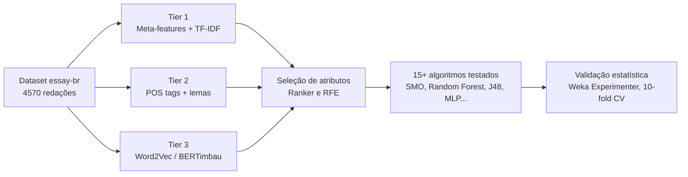
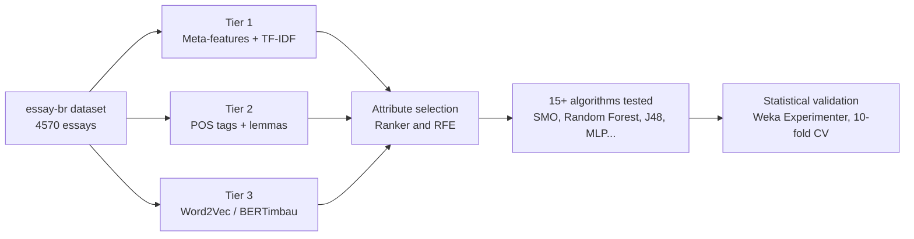

# enem-essay-classifier

**Python · scikit-learn · SpaCy · BERTimbau · Weka**

Classificação automática de redações do ENEM em quatro faixas de nota (Insuficiente, Regular, Bom, Excelente), comparando três níveis de representação de texto (features de superfície, gramaticais e embeddings), mais de 15 algoritmos de classificação e seleção de atributos, com validação estatística no Weka Experimenter.

[Leia em inglês ↓](#english) · UTFPR · Aprendizado de Máquina (AM46S) · MIT License

---

## Português

### Sobre o projeto
Trabalho da disciplina de Aprendizado de Máquina (AM46S, UTFPR), que investiga se é possível prever a faixa de nota de uma redação do ENEM a partir do texto, comparando representações interpretáveis (contagens, TF-IDF, classes gramaticais) com uma representação de caixa-preta (embeddings BERTimbau). A melhor combinação encontrada (Tier 1 mais Tier 3 com seleção de atributos) atingiu 61,05% de acurácia e Kappa de 0,3805.

### Dataset
[Essay-BR](https://github.com/rafaelanchieta/essay), corpus público de redações argumentativas em português, com notas por competência no padrão ENEM. Usamos um subconjunto de 4.570 redações com nota total e classificação em quatro faixas (Insuficiente, Regular, Bom, Excelente).

### Pipeline



### Tiers de features
- **Tier 1**, features de superfície (contagem de palavras, caracteres, pontuação, proporção de maiúsculas) mais TF-IDF com 500 termos.
- **Tier 2**, classes gramaticais via SpaCy (substantivo, verbo, adjetivo e outras), razões sintáticas (subordinação, densidade de pronomes) mais TF-IDF sobre lemas.
- **Tier 3**, embeddings Word2Vec (NILC) e BERTimbau, representação densa sem interpretabilidade direta.

### Seleção de atributos
Reprodução em Python dos métodos do Weka. Ranker com informação mútua e ANOVA F-value equivalem ao GainRatio e ao CorrelationAttributeEval; Recursive Feature Elimination (RFE) com Random Forest equivale ao BestFirst.

### Algoritmos testados
Mais de 15 algoritmos, entre eles SMO (SVM linear), Random Forest, J48 (árvore de decisão), MLP, Regressão Logística, Gradient Boosting e um Voting Classifier combinando os três melhores modelos. Também foram testados KMeans, Gaussian Mixture e DBSCAN para clusterização exploratória, e SMOTE para balanceamento de classes.

### Validação estatística
10-fold cross-validation estratificada em todos os experimentos, com Acurácia, Kappa, MCC, Precision, Recall e F1-Score por classe, replicando o nível de detalhe do Weka Experimenter.

### Resultados
| Experimento | Acurácia | Kappa |
|---|---|---|
| Tier 1 reforçado (sozinho) | 57,64% | 0,317 |
| Tier 2 reforçado (sozinho) | 57,13% | 0,305 |
| Tier 3 BERTimbau (sozinho) | 58,73% | 0,333 |
| Tier 1 + Tier 3 (PCA) | 58,45% | 0,325 |
| **Tier 1 + Tier 3 (PCA) + seleção de atributos (RFE)** | **61,05%** | **0,3805** |

### Como reproduzir
```bash
pip install pandas numpy scikit-learn spacy imbalanced-learn transformers torch
python -m spacy download pt_core_news_sm
```
Os scripts em `src/features/` geram os arquivos `.arff` prontos para o Weka a partir do dataset original (baixe o Essay-BR e ajuste o caminho `CSV_PATH` no topo de cada script). Os scripts em `src/classificacao/` e `src/selecao_atributos/` replicam em Python os experimentos rodados no Weka Experimenter, a partir dos CSVs gerados pelos scripts de features.

### Nota sobre reprodutibilidade
Dois arquivos usados pelos scripts de junção, combinação e seleção de atributos (`data/feature_tema.csv` e `tier1_reforcado_500.csv`) foram gerados por scripts auxiliares do grupo que não foram recuperados. `feature_tema.csv` está incluído neste repositório pronto para uso. `tier1_reforcado_500.csv` não está incluído por ser um arquivo grande (13,5 MB); quem precisar reproduzir os experimentos que dependem dele deve solicitar o arquivo diretamente aos autores.

### Estrutura do repositório
```
src/features/          extração das features de cada tier
src/clustering/         KMeans, EM, DBSCAN
src/classificacao/      algoritmos de classificação, binário e multiclasse
src/selecao_atributos/  seleção de atributos, Ranker e RFE
data/                    features pequenas geradas e reutilizadas entre scripts
results/                CSVs com os resultados de cada experimento
```

### Colaboradores
Projeto em grupo para a disciplina de Aprendizado de Máquina (AM46S, UTFPR).
- Danilo P. Neto
- Monica P. O. Mackert
- Yuri Matsumoto Santos

### Licença
MIT, veja o arquivo [LICENSE](LICENSE).

---

## English

### About the project
Group project for the Machine Learning course (AM46S, UTFPR), investigating whether an ENEM essay's score range can be predicted from its text, comparing interpretable representations (counts, TF-IDF, grammatical classes) with a black-box representation (BERTimbau embeddings). The best combination found (Tier 1 plus Tier 3 with attribute selection) reached 61.05% accuracy and a Kappa of 0.3805.

### Dataset
[Essay-BR](https://github.com/rafaelanchieta/essay), a public corpus of argumentative essays in Portuguese, scored per competence following the ENEM standard. We used a subset of 4,570 essays with a total score and a classification into four bands (Insufficient, Regular, Good, Excellent).

### Pipeline



### Feature tiers
- **Tier 1**, surface features (word count, character count, punctuation, uppercase ratio) plus TF-IDF with 500 terms.
- **Tier 2**, grammatical classes via SpaCy (noun, verb, adjective and others), syntactic ratios (subordination, pronoun density) plus TF-IDF over lemmas.
- **Tier 3**, Word2Vec (NILC) and BERTimbau embeddings, a dense representation without direct interpretability.

### Attribute selection
A Python reproduction of Weka's methods. Ranker with mutual information and ANOVA F-value are equivalent to GainRatio and CorrelationAttributeEval; Recursive Feature Elimination (RFE) with Random Forest is equivalent to BestFirst.

### Algorithms tested
More than 15 algorithms, including SMO (linear SVM), Random Forest, J48 (decision tree), MLP, Logistic Regression, Gradient Boosting and a Voting Classifier combining the three best models. KMeans, Gaussian Mixture and DBSCAN were also tested for exploratory clustering, along with SMOTE for class balancing.

### Statistical validation
Stratified 10-fold cross-validation across all experiments, with Accuracy, Kappa, MCC, Precision, Recall and F1-Score per class, matching the level of detail of the Weka Experimenter.

### Results
| Experiment | Accuracy | Kappa |
|---|---|---|
| Tier 1 reinforced (alone) | 57.64% | 0.317 |
| Tier 2 reinforced (alone) | 57.13% | 0.305 |
| Tier 3 BERTimbau (alone) | 58.73% | 0.333 |
| Tier 1 + Tier 3 (PCA) | 58.45% | 0.325 |
| **Tier 1 + Tier 3 (PCA) + attribute selection (RFE)** | **61.05%** | **0.3805** |

### How to reproduce
```bash
pip install pandas numpy scikit-learn spacy imbalanced-learn transformers torch
python -m spacy download pt_core_news_sm
```
Scripts in `src/features/` generate the `.arff` files ready for Weka from the original dataset (download Essay-BR and adjust the `CSV_PATH` at the top of each script). Scripts in `src/classificacao/` and `src/selecao_atributos/` reproduce in Python the experiments run in the Weka Experimenter, using the CSVs generated by the feature scripts.

### Reproducibility note
Two files used by the merging, combination and attribute selection scripts (`data/feature_tema.csv` and `tier1_reforcado_500.csv`) were generated by auxiliary scripts the group did not recover. `feature_tema.csv` is included in this repository ready to use. `tier1_reforcado_500.csv` is not included because it is a large file (13.5 MB); anyone who needs to reproduce the experiments that depend on it should request the file directly from the authors.

### Repository structure
```
src/features/          feature extraction for each tier
src/clustering/         KMeans, EM, DBSCAN
src/classificacao/      classification algorithms, binary and multiclass
src/selecao_atributos/  attribute selection, Ranker and RFE
data/                    small generated features reused across scripts
results/                CSVs with each experiment's results
```

### Collaborators
Group project for the Machine Learning course (AM46S, UTFPR).
- Danilo P. Neto
- Monica P. O. Mackert
- Yuri Matsumoto Santos

### License
MIT, see the [LICENSE](LICENSE) file.
